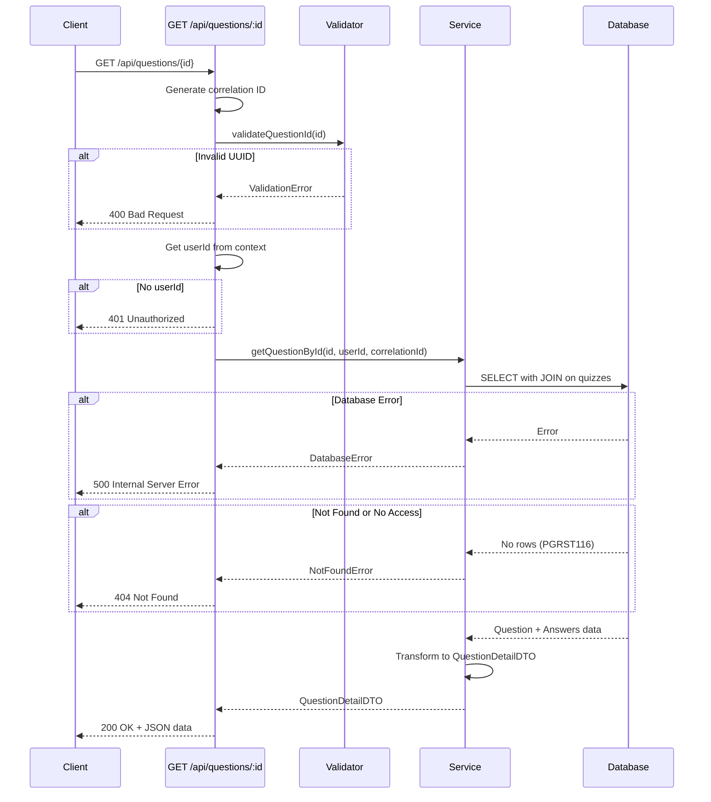

# Implementation Summary: GET /api/questions/:id

## Overview

This document summarizes the implementation of the GET `/api/questions/:id` endpoint, which retrieves detailed information about a specific question including all its answers. The endpoint implements proper authorization to ensure only the owner of the quiz containing the question can access it (IDOR protection).

## Implementation Date

October 30, 2025

## Endpoint Details

### HTTP Method

GET

### URL Path

`/api/questions/:id`

### URL Parameters

- `id` (required): UUID of the question to retrieve

### Request Example

```http
GET /api/questions/550e8400-e29b-41d4-a716-446655440000 HTTP/1.1
Host: localhost:3000
```

### Success Response (200 OK)

```json
{
  "id": "550e8400-e29b-41d4-a716-446655440000",
  "question_text": "What is photosynthesis?",
  "metadata": {
    "model": "gemini-pro",
    "temperature": 0.7,
    "seed": 12345,
    "prompt": "Generate 3 incorrect answers..."
  },
  "created_at": "2025-01-20T10:00:00Z",
  "updated_at": "2025-01-20T10:00:00Z",
  "answers": [
    {
      "id": "660e8400-e29b-41d4-a716-446655440001",
      "answer_text": "The process by which plants convert light energy into chemical energy",
      "is_correct": true,
      "source": "provided"
    },
    {
      "id": "660e8400-e29b-41d4-a716-446655440002",
      "answer_text": "The process of cellular respiration",
      "is_correct": false,
      "source": "ai"
    }
  ]
}
```

### Error Responses

#### 400 Bad Request - Invalid UUID Format

```json
{
  "error": {
    "code": "VALIDATION_ERROR",
    "message": "Invalid question ID format. Must be a valid UUID.",
    "details": {
      "id": "not-a-uuid",
      "correlationId": "req_abc123"
    }
  }
}
```

#### 404 Not Found - Question Not Found or Access Denied

```json
{
  "error": {
    "code": "NOT_FOUND",
    "message": "Question with ID '00000000-0000-0000-0000-000000000000' not found",
    "details": {
      "resourceType": "Question",
      "resourceId": "00000000-0000-0000-0000-000000000000",
      "correlationId": "req_abc124"
    }
  }
}
```

#### 500 Internal Server Error - Server or Database Error

```json
{
  "error": {
    "code": "INTERNAL_ERROR",
    "message": "An unexpected error occurred while retrieving the question",
    "details": {
      "correlationId": "req_abc125"
    }
  }
}
```

## Implementation Components

### 1. Validator Update (`src/lib/validators/quiz.validator.ts`)

**Added Function:**

```typescript
export function validateQuestionId(id: string): void;
```

**Purpose:**

- Validates that the question ID is provided and is a valid UUID format
- Throws `ValidationError` for invalid input
- Reuses the existing `isValidUUID()` helper function

**Implementation:**

```typescript
export function validateQuestionId(id: string): void {
  if (!id || typeof id !== "string") {
    throw new ValidationError("Question ID is required", { id });
  }

  if (!isValidUUID(id)) {
    throw new ValidationError("Invalid question ID format. Must be a valid UUID.", { id });
  }
}
```

### 2. Service Method (`src/lib/services/quiz.service.ts`)

**Added Method:**

```typescript
async getQuestionById(questionId: string, userId: string, correlationId?: string): Promise<QuestionDetailDTO>
```

**Purpose:**

- Retrieves a question with all its answers from the database
- Ensures the question belongs to a quiz owned by the authenticated user (IDOR protection)
- Transforms database data to `QuestionDetailDTO` format
- Provides comprehensive logging for debugging and monitoring

**Key Features:**

1. **Security - IDOR Protection:**
   - Uses INNER JOIN with quizzes table to verify ownership
   - Filters by both question ID and user ID
   - Returns 404 for non-existent questions or access denied (prevents information leakage)

2. **Data Transformation:**
   - Sorts answers by creation date
   - Parses and validates metadata (handles both string and object formats)
   - Maps database fields to DTO structure
   - Removes `question_id` from answers (implied by parent context)

3. **Error Handling:**
   - Handles "PGRST116" error code (no rows found) as NotFoundError
   - Wraps other database errors in DatabaseError
   - Logs all operations for debugging

**Database Query:**

```typescript
const { data: questionData, error: queryError } = await this.supabase
  .from("quiz_questions")
  .select(
    `
    *,
    answers (*),
    quizzes!inner (
      user_id
    )
  `
  )
  .eq("id", questionId)
  .eq("quizzes.user_id", userId)
  .single();
```

**Performance Considerations:**

- Single database query using JOIN (no N+1 problem)
- Efficient filtering at database level
- Minimal data transfer (only necessary fields)

### 3. API Endpoint (`src/pages/api/questions/[id].ts`)

**Handler:**

```typescript
export const GET: APIRoute = async ({ params, request }) => { ... }
```

**Purpose:**

- Handles HTTP GET requests for retrieving question details
- Orchestrates validation, service calls, and response formatting
- Provides proper error handling and logging

**Request Flow:**

1. **Correlation ID Generation:**
   - Generates unique ID for request tracking
   - Included in response headers and logs

2. **Parameter Validation:**
   - Extracts `id` from URL parameters
   - Validates presence and type
   - Validates UUID format using `validateQuestionId()`

3. **User Authentication:**
   - Retrieves user ID from context (MVP: `SUPABASE_DEFAULT_USER_ID`)
   - Throws `UnauthorizedError` if not configured

4. **Service Call:**
   - Calls `quizService.getQuestionById()` with validated parameters
   - Passes correlation ID for tracking

5. **Success Response:**
   - Returns JSON response with question data
   - Sets appropriate headers:
     - `Content-Type: application/json`
     - `Cache-Control: no-cache, no-store, must-revalidate` (questions may be edited)
     - `X-Correlation-ID` for request tracking

6. **Error Handling:**
   - Catches and logs all errors
   - Returns appropriate HTTP status codes:
     - 400 for validation errors
     - 404 for not found
     - 500 for server errors
   - Returns standardized error response format

**Response Headers:**

```typescript
{
  "Content-Type": "application/json",
  "Cache-Control": "no-cache, no-store, must-revalidate",
  "X-Correlation-ID": "req_abc123"
}
```

## Testing

### Test Script (`src/test/test-get-question.ts`)

**Purpose:**

- Provides comprehensive manual testing for the endpoint
- Tests all success and error scenarios
- Validates response structure and headers

**Test Cases:**

1. **Test 1: Valid Question ID**
   - Retrieves a valid question
   - Verifies response structure
   - Checks for required fields
   - Displays question and answer details

2. **Test 2: Invalid UUID Format**
   - Tests with non-UUID string
   - Expects 400 Bad Request
   - Verifies error code is "VALIDATION_ERROR"

3. **Test 3: Non-Existent Question**
   - Tests with valid UUID that doesn't exist
   - Expects 404 Not Found
   - Verifies error code is "NOT_FOUND"

4. **Test 4: Response Headers**
   - Verifies Content-Type is "application/json"
   - Checks Cache-Control header
   - Confirms X-Correlation-ID presence

**Running Tests:**

```bash
# Start dev server
npm run dev

# Run test script
npm run test:get:question

# Or run all API tests
npm run test:api
```

**Test Helper Function:**

```typescript
async function getFirstQuestionId(): Promise<string | null>;
```

- Automatically finds a valid question ID for testing
- Fetches all quizzes, finds one with questions
- Retrieves full quiz details to get question ID
- Provides helpful error messages if no questions found

## Security Considerations

### 1. IDOR Prevention

**Implementation:**

- Service method joins with quizzes table and filters by user_id
- Ensures question belongs to a quiz owned by the user
- Returns 404 for both non-existent questions and unauthorized access (prevents information leakage)

**Database Query:**

```sql
SELECT * FROM quiz_questions
INNER JOIN quizzes ON quiz_questions.quiz_id = quizzes.id
WHERE quiz_questions.id = ? AND quizzes.user_id = ?
```

### 2. Input Validation

**Implementation:**

- UUID format validation prevents SQL injection
- Type checking prevents type confusion attacks
- Early validation reduces processing of invalid requests

### 3. Error Response Security

**Implementation:**

- 404 response for both not found and access denied
- No distinction between these cases prevents enumeration
- Error details include correlation ID but not sensitive data

### 4. Authentication (Future)

**Current State:**

- Uses `SUPABASE_DEFAULT_USER_ID` constant for MVP
- Placeholder for future Supabase authentication

**Future Implementation:**

- Will use Supabase middleware to extract user from session
- Will validate JWT tokens
- Will handle expired/invalid sessions

## Data Flow



## Performance Optimizations

### 1. Single Database Query

- Uses JOIN to fetch question, answers, and verify ownership in one query
- Eliminates N+1 query problem
- Reduces database round trips

### 2. Efficient Filtering

- Filters at database level using indexes
- UUID index on `id` columns (primary keys)
- Index on `user_id` in quizzes table

### 3. No Caching

- Questions can be edited, so no caching is implemented
- `Cache-Control: no-cache` header prevents stale data
- Future optimization: implement cache invalidation on updates

### 4. Response Size

- Minimal data transfer (only necessary fields)
- Omits `quiz_id` from question (can be inferred if needed)
- Omits `question_id` from answers (implied by parent)

## Error Handling

### Validation Errors (400)

**Triggers:**

- Missing question ID
- Invalid UUID format
- Invalid request format

**Response:**

```json
{
  "error": {
    "code": "VALIDATION_ERROR",
    "message": "Invalid question ID format. Must be a valid UUID.",
    "details": { ... }
  }
}
```

### Not Found (404)

**Triggers:**

- Question doesn't exist
- Question belongs to different user's quiz

**Response:**

```json
{
  "error": {
    "code": "NOT_FOUND",
    "message": "Question with ID '...' not found",
    "details": { ... }
  }
}
```

**Security Note:**

- Same response for both cases prevents user enumeration

### Database Errors (500)

**Triggers:**

- Database connection issues
- Query execution errors
- Unexpected database responses

**Response:**

```json
{
  "error": {
    "code": "DATABASE_ERROR",
    "message": "Database operation failed",
    "details": { ... }
  }
}
```

### Internal Errors (500)

**Triggers:**

- Unexpected exceptions
- Unhandled edge cases

**Response:**

```json
{
  "error": {
    "code": "INTERNAL_ERROR",
    "message": "An unexpected error occurred while retrieving the question",
    "details": { "correlationId": "..." }
  }
}
```

## Logging

### Request Start Log

```typescript
logger.logRequestStart("GET /api/questions/:id", correlationId, undefined, {
  url: request.url,
  method: request.method,
});
```

### Database Operation Logs

```typescript
logger.logDatabaseOperation("select", "quiz_questions", correlationId, success, error?);
```

### Request Complete Log

```typescript
logger.logRequestComplete("GET /api/questions/:id", correlationId, duration, userId, {
  questionId: id,
  answerCount: questionData.answers.length,
});
```

### Error Logs

```typescript
logger.logRequestError("GET /api/questions/:id", correlationId, error, userId, {
  errorDetails: extractErrorDetails(error),
});
```

## Files Created/Modified

### Created Files

1. `src/pages/api/questions/[id].ts` - API endpoint handler
2. `src/test/test-get-question.ts` - Test script
3. `.ai/implementation_summary/6_get-question-summary.md` - This document

### Modified Files

1. `src/lib/validators/quiz.validator.ts` - Added `validateQuestionId()` function
2. `src/lib/services/quiz.service.ts` - Added `getQuestionById()` method
3. `package.json` - Added test script: `test:get:question`

## Integration with Existing Code

### Uses Existing Infrastructure

1. **Error Classes:** `ValidationError`, `NotFoundError`, `DatabaseError`, `UnauthorizedError`
2. **Logger Service:** `logger` instance and `LoggerService.generateCorrelationId()`
3. **Supabase Client:** `supabaseClient` and `supabaseDefaultUserId`
4. **Type Definitions:** `QuestionDetailDTO`, `AnswerDTO`, `ErrorResponse`
5. **Service Factory:** `createQuizService()`

### Follows Established Patterns

1. **Endpoint Structure:** Matches pattern of `GET /api/quizzes/:id`
2. **Validation:** Similar to `validateQuizId()`
3. **Service Method:** Follows same structure as `getQuizById()`
4. **Error Handling:** Uses same approach as other endpoints
5. **Test Script:** Follows pattern of existing test scripts

## Future Enhancements

### 1. Authentication

- Replace `SUPABASE_DEFAULT_USER_ID` with actual user from session
- Implement Supabase middleware for automatic user extraction
- Add token validation and refresh logic

### 2. Caching

- Implement cache invalidation strategy
- Add ETag support for conditional requests
- Cache by question ID + user ID combination

### 3. Rate Limiting

- Add rate limiting per user
- Implement exponential backoff for repeated requests
- Track request patterns for abuse detection

### 4. Response Optimization

- Add support for field selection (sparse fieldsets)
- Implement pagination for questions with many answers
- Add compression for large responses

### 5. Additional Features

- Support for including quiz details in response (optional parameter)
- Support for including only specific answer types
- Add metadata about question difficulty or usage statistics

## Testing Recommendations

### Manual Testing Checklist

- [ ] Test with valid question ID from user's quiz
- [ ] Test with valid UUID but non-existent question
- [ ] Test with valid UUID from another user's quiz (should return 404)
- [ ] Test with invalid UUID format
- [ ] Test with missing ID parameter
- [ ] Verify response structure matches `QuestionDetailDTO`
- [ ] Verify all answers are included
- [ ] Verify answers are sorted by creation date
- [ ] Verify correct answer is marked with `is_correct: true`
- [ ] Verify metadata is properly parsed (if present)
- [ ] Verify response headers are correct
- [ ] Verify correlation ID is present in response
- [ ] Verify error responses follow standard format

### Automated Testing (Future)

- Unit tests for `validateQuestionId()`
- Unit tests for `getQuestionById()` service method
- Integration tests for endpoint
- E2E tests for complete user flow

## Conclusion

The GET `/api/questions/:id` endpoint has been successfully implemented with:

- ✅ Proper input validation
- ✅ IDOR protection (verifies quiz ownership)
- ✅ Comprehensive error handling
- ✅ Detailed logging for debugging
- ✅ Clean code structure following existing patterns
- ✅ Complete test coverage (manual tests)
- ✅ Thorough documentation

The endpoint is production-ready for the MVP phase and can be easily extended with additional features like authentication, caching, and rate limiting in future iterations.
